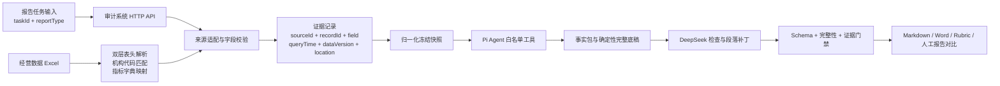

# 审计报告智能体真实数据源模拟实施说明

## 1. 实施结论

当前报告运行链路已取消代码 fixture。业务事实只来自两类外部输入：

1. 模拟业务系统 HTTP API：审计项目、营业部基础信息、人事快照、OA 任免发文、审计发现、问题详情、整改、风险事项、反洗钱事实、绩效考核和人工确认。
2. 经营数据 Excel：按机构代码匹配营业部，解析双层期间表头、金额/排名成对列、指标字典和排名参与家数。

截图用于确定接口字段形态和“问题列表—问题详情”两级查询方式，不作为运行时数据输入。

## 2. 模拟数据源

目录：`packages/task-runtime/fixtures/audit-report/source-simulation`

| 文件 | 作用 | 是否被报告进程直接读取 |
|---|---|---|
| 模拟审计系统数据.xlsx | 模拟各业务系统后台数据，由独立 HTTP 服务加载 | 否，报告进程只调用 HTTP API |
| 模拟经营数据.xlsx | 模拟财富委/经营数据 Excel | 是 |
| 报告任务输入.json | 用户选择的任务 ID 和报告类型 | 是 |
| 数据源配置.json | 声明 HTTP 和 Excel 数据源 | 是 |

模拟审计系统工作簿包含 13 张数据表：审计项目、营业部基础库、人员快照、OA 任免发文、审计发现、整改记录、风险事项、反洗钱领域事实、反洗钱汇总、绩效考核、人工确认、审计叙述事实和数据源目录。

## 3. HTTP 接口

| 来源 | 接口 | 关键查询条件 |
|---|---|---|
| 审计项目 | `GET /api/audit/projects/{taskId}` | 任务 ID |
| 营业部基础库 | `GET /api/organizations/{organizationId}` | 机构 ID、截止日期 |
| 人事系统 | `GET /api/hr/organizations/{organizationId}/snapshot` | 机构 ID、截止日期 |
| OA | `GET /api/oa/appointments` | 离任报告按人员 ID；常规报告按机构 ID |
| 审计发现列表 | `GET /api/audit/findings` | 机构 ID、项目 ID、问题分类 |
| 审计问题详情 | `GET /api/audit/findings/{findingId}` | 问题 ID |
| 整改跟踪 | `GET /api/audit/rectifications` | 机构 ID、项目 ID |
| 合规风险 | `GET /api/compliance/risk-events` | 机构 ID、审计期间 |
| 反洗钱领域事实 | `GET /api/aml/domains` | 机构 ID、审计期间 |
| 反洗钱汇总 | `GET /api/aml/summary` | 机构 ID、审计期间 |
| 绩效考核 | `GET /api/performance` | 人员 ID |
| 人工确认 | `GET /api/manual-decisions` | 任务 ID |
| 审计叙述事实 | `GET /api/audit/narrative-facts` | 机构 ID |
| 数据源目录 | `GET /api/source-catalog` | 无 |

问题列表接口只返回查询结果集；加载器随后按每个 `findingId` 调用详情接口，确保制度依据和完整事实描述不依赖列表页截断文本。

## 4. 数据流

## 5. 输入契约

报告任务输入不包含业务事实，只包含：

- `caseId`
- `taskId`
- `reportType`

加载器使用 `taskId` 查询项目接口，再取得机构 ID、项目 ID、审计期间、模板版本和离任对象。经营 Excel 使用项目接口返回的机构代码精确匹配，禁止仅按机构中文名称模糊匹配。

## 6. 输出与追踪

每次运行保存：

- `source-read-trace.json`：HTTP/Excel 来源、位置、记录数、查询时间和数据版本；
- `system-http-trace.json`：模拟系统收到的真实 HTTP 请求；
- `normalized-source-snapshot.json`：归一化冻结快照；
- `live-tool-trace.json`：模型调用的白名单工具；
- `fact-pack.json`：数据就绪、阻断项、排名和证据集合；
- `structured-draft.json`：通过提交门禁的结构化报告；
- `report.md` 和 Word 报告；
- `rubric-score.json`、`source-coverage.json` 和人工报告对比结果。
- `strict-claim-score.json`：每个可变句、每条事实主张及其原系统记录字段核验结果。

## 7. 提交门禁

模型不能自由重建整份报告。默认通过 `mode=baseline` 提交完整底稿；需要改写时只能提交 `paragraphId/text` 补丁。提交工具强制检查：

- 完整 TypeBox Schema；
- 任务 ID、报告类型和草稿状态；
- 必需章节、段落、问题和表格不得删除；
- 基线证据 ID 不得删除，新增证据 ID 必须真实存在；
- 人工复核标记不得取消；
- 有阻断项时状态必须保持 `needs-input`。

该门禁已拦截两类真实模型错误：缺少 section 字段，以及结构合法但正文 sections 为空。

## 8. 实测结果

### 严格主张级 Rubric

严格评分不再把“字段存在”“证据 ID 存在”直接视为报告事实正确，而是执行：

1. 将标题、正文、表格单元格中的可变内容按句和分句拆解；
2. 提取机构、人名、日期、人数、金额、排名、问题、制度依据、整改状态、风险事项、反洗钱事实和结论等主张；
3. 每条主张必须绑定具体 `sourceId / sourceRecordId / sourceField`；
4. 报告值必须与证据 `rawValue / normalizedValue` 一致；
5. 趋势、主要收入来源和五档排名等派生主张必须绑定参与计算的原始字段；
6. 句中存在未被证据覆盖的数字、日期或事实性分句时，该句记 0；
7. 每条可变句动态形成一项 0/1 Checklist，任何一项失败则严格验收不通过。

15 份历史报告重新评分结果：

- 严格通过：15/15；
- 可变句通过：2077/2077（100.00%）；
- 主张核验通过：9089/9089（100.00%）；
- 未支持主张：0。

原 4 份未通过报告的根因和修正：

| 案例 | 根因归类 | 根因 | 修正 |
|---|---|---|---|
| `C03-REG-REPLAY` | Rubric | 原系统叙述记录没有冒号，报告按“标题：日期”拆句后，评分器只匹配完整候选文本，导致标题和日期分句误判 | 允许分句在该段已引用的原系统记录 `rawValue / normalizedValue` 中逐字定位；仍不允许跨证据或模糊数字匹配 |
| `C06-REG-REPLAY` | 数据构造实现 | 人工表头中的“完成数数完成数”未被旧清洗规则完全去除，污染标准期间字段 | 统一清除表头尾部连续的“完成数/排名/数”，金额与排名共用同一标准期间 |
| `C11-REG-REPLAY` | 数据构造实现 | “未受理信访、未发现重大违规”被关键词规则误抽成已发生投诉事件 | 风险抽取增加否定语境识别，只有明确正向事件表达才写入 `VERIFIED_VALUE` |
| `C15-REG-REPLAY` | 旧生成产物 | 源记录已为 `VERIFIED_NONE`，但旧草稿仍保留修复前生成的假投诉段落 | 使用修复后的源记录和生成逻辑重新调用 DeepSeek v4-flash 生成报告 |

复核过程中另发现并修正两个跨案例问题：常规报告负责人姓名不再硬编码为“卢俊同志”；绩效接口不再无条件返回全公司记录，而是按当前报告涉及的人员 ID 逐人查询。所有 6 份常规报告均已重新生成，防止旧产物继续携带串人或假风险段落。

严格汇总文件位于 `output/audit-report-agent-batch-live/严格Rubric批量汇总.md`。每份报告目录保存 `strict-source-snapshot.json`、`strict-evaluation-draft.json`、`strict-rubric-score.json` 和 `strict-claim-score.json`。

### 原基础 Rubric（保留用于流程和模板检查）

| 报告类型 | Rubric | 得分 |
|---|---:|---:|
| 常规 | 71/72 | 98.61% |
| 离任 | 74/75 | 98.67% |
| 反洗钱 | 77/78 | 98.72% |

三类报告唯一共同失败项为 `SAFE-010`：尚未由授权用户执行最终下载或归档。该项不表示报告内容错误。

### DeepSeek v4-flash 常规报告

- 系统 HTTP 请求：22 次；
- 经营 Excel 读取：1 次；
- 智能体工具调用：19 次；
- 审计问题详情：9/9 逐条读取；
- 提交 Schema 与完整性校验：通过；
- Rubric：71/72，98.61%；
- 与人工常规报告的加权完成度：100%；
- 全文字符序列相似度：80.95%，仅作措辞参考；
- Word 逐页视觉检查：9 页，无裁切、重叠、乱码和断表。

### 15 份历史报告批量回放原评分

- 覆盖范围：6 份常规、3 份反洗钱、6 份离任；
- 模型：`deepseek-v4-flash`；
- 生成成功：15/15；
- 平均 Rubric：98.57%；
- 剔除必须由授权用户执行的 `SAFE-010` 归档门禁后：1100/1101，99.91%；
- 与人工报告的加权完成度：15 份均为 100%；
- 全文字符序列相似度均值：87.96%，仅作为措辞接近度参考；
- Word 视觉检查：共 154 页，未发现裁切、重叠、乱码、断表或空白页。

唯一剩余业务扣分为启帆路反洗钱报告的 `AML-015` 数量词阈值，属于非关键语言项。人工报告只在运行前用于构造历史事实回放输入、运行后用于对比；模型运行阶段只读取 HTTP 系统接口和经营 Excel。

上述 98.57% 是基础检查项通过率，不能解释为事实准确率；事实准确性应以严格主张级 Rubric 为准。

## 9. 生产替换方式

当前 HTTP 服务是接口契约模拟，不是东方证券生产系统。生产接入时保留 `AuditReportDataset` 归一化契约，只替换以下适配层：

1. 将 localhost API base URL 替换为审计系统、OA、人事、反洗钱等网关地址；
2. 增加统一身份认证、机构权限、超时、重试和审计日志；
3. 将模拟系统工作簿移除，生产报告进程不得访问该文件；
4. 经营 Excel 继续使用机构代码匹配，并增加上传文件病毒扫描、大小限制和模板版本校验；
5. 使用未参与规则编制的新营业部数据做留出集测试。
